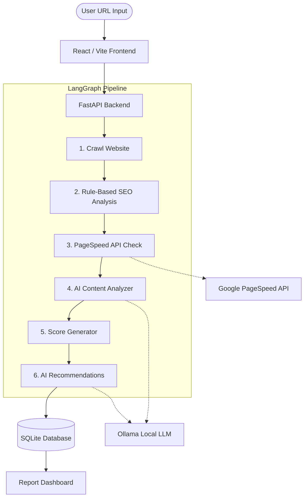

# 🔍 SEO Analyzer (GenAI Edition)

**AI-powered full-stack SEO audit tool** built with LangGraph orchestration, FastAPI backend, React (Vite) frontend, and local LLMs via Ollama.

Enter any URL to get a comprehensive SEO analysis containing rule-based scores, issue detection, and **GenAI-powered actionable recommendations**.

---

## 🚀 Key Features

*   **Website Crawling**: Automatically extracts title, meta tags, headings, image alt texts, links, open graph tags, and structured data.
*   **Deep SEO Analysis**: Checks 15+ critical SEO signals (canonical URLs, robots meta, viewport, HTTPS, heading hierarchy, etc.).
*   **Performance Metrics**: Integrates with the Google PageSpeed Insights API for Core Web Vitals (FCP, LCP, CLS, etc.).
*   **🧠 GenAI Insights (Powered by local LLMs)**:
    *   **Content Analysis**: Evaluates content quality, readability, and keyword relevance.
    *   **Actionable Recommendations**: Generates prioritized, plain-English steps to improve your SEO score.
    *   **Smart Meta Tags**: Automatically writes optimized Title and Meta Description tags tailored to your content.
*   **LangGraph Orchestration**: Uses a robust 6-node state machine workflow to reliably manage the entire analysis pipeline.

---

## 🏗️ System Architecture



---

## 🛠️ Tech Stack
*   **Backend**: Python 3.10+, FastAPI, LangGraph, SQLAlchemy, BeautifulSoup4, LangChain
*   **Frontend**: React 18, Vite, standard CSS (Glassmorphism UI)
*   **AI Engine**: Ollama (Mistral by default)
*   **Database**: SQLite (swap easily to PostgreSQL if needed via SQLAlchemy)
*   **Containerization**: Docker & Docker Compose

---

## 💻 How to Run (Local Development)

### Prerequisites
1.  **Python 3.10** or higher
2.  **Node.js 18** or higher
3.  **Ollama**: Download and install from [ollama.com](https://ollama.com)

### 1. Start the Local AI Model (Ollama)
The application uses the `mistral` model by default for fast, accurate SEO analysis.
```bash
# Pull and start the model (the first run will take a few minutes to download ~4GB)
ollama run mistral
```
*Keep Ollama running in the background.*

### 2. Setup the Backend (FastAPI)
Open a new terminal and navigate to the `backend` folder:
```bash
cd backend

# Create a virtual environment
python -m venv venv

# Activate the virtual environment
# On Windows:
venv\Scripts\activate
# On macOS/Linux:
source venv/bin/activate

# Install dependencies
pip install -r requirements.txt

# Start the backend server
python -m uvicorn app.main:app --reload --port 8000
```
The API will be available at `http://localhost:8000`. You can view the automated API docs at `http://localhost:8000/docs`.

### 3. Setup the Frontend (React)
Open another terminal and navigate to the `frontend` folder:
```bash
cd frontend

# Install dependencies
npm install

# Start the development server
npm run dev
```
Open **`http://localhost:5173`** in your browser to use the application!

---

## 🐳 How to Run (Docker)

If you have Docker installed, you can spin up the Frontend and Backend effortlessly:
```bash
docker-compose up --build
```
*   **Frontend**: `http://localhost:3000`
*   **Backend API**: `http://localhost:8000`

*(Note: If you run it via Docker, ensure that your `OLLAMA_BASE_URL` in `docker-compose.yml` points to your host machine's Ollama instance, e.g., `http://host.docker.internal:11434`)*

---

## ⚙️ Environment Variables

You can customize the application behavior by setting these environment variables in your backend environment (or `.env` file):

| Variable | Description | Default |
|----------|-------------|---------|
| `DATABASE_URL` | SQLAlchemy connection string | `sqlite:///./seo_analyzer.db` |
| `PAGESPEED_API_KEY` | Google PageSpeed API key | *(empty - uses free, rate-limited tier)* |
| `OLLAMA_BASE_URL` | Local URL for the Ollama engine | `http://localhost:11434` |
| `OLLAMA_MODEL` | The LLM to use for insights | `mistral` |
| `CRAWLER_TIMEOUT` | Max seconds to wait for a URL fetch | `30` |

---

## 📊 Scoring Methodology

The final score represents the overall health of the website, combining traditional heuristics with modern AI evaluation:

*   **On-Page SEO (30%)**: Metadata, headings, links, image attributes.
*   **Technical SEO (25%)**: HTTPS, canonicals, robots.txt directives, viewport settings.
*   **Performance (25%)**: Core Web Vitals derived from the Google PageSpeed API.
*   **AI Content Quality (20%)**: Semantic evaluation of keyword relevance and readability by the LLM.

### Grades
*   🟢 **A**: 90 - 100
*   🟢 **B**: 80 - 89
*   🟡 **C**: 70 - 79
*   🟠 **D**: 60 - 69
*   🔴 **F**: 0 - 59

---

## 📄 License
MIT License - Free to use, modify, and distribute.
